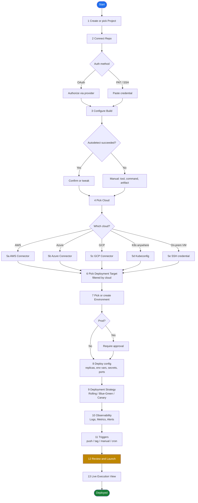
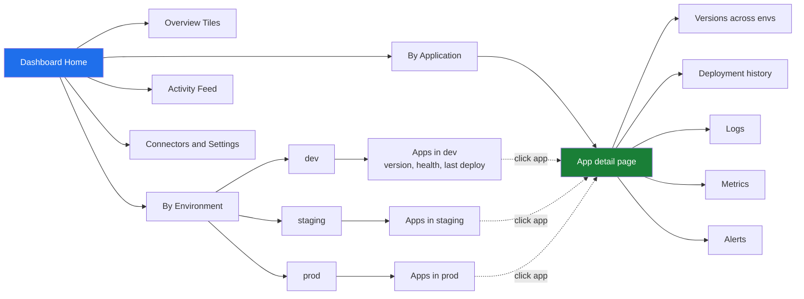

# Deployment Delivery —  Requirements

> **Vision:** A single place where a developer can connect a code repository, configure a target cloud, deploy it, and then observe it — *and* a dashboard view that surfaces everything that has been set up across environments. Everything configurable. 

---

## 1. Scope (what we are building)

**In scope (v1):**
- Connect a source repository
- Build the app (containerize or package)
- Pick & configure a target cloud / runtime
- Deploy with a chosen strategy
- Centralized logs, metrics, deployment history
- A dashboard view of all apps, environments, and recent activity


## 2. Personas

| Persona | What they do here |
|---|---|
| **Developer** | Connects a repo, configures the build, watches their deploy, reads logs |
| **DevOps / Platform engineer** | Sets up cloud connectors, environments, secrets, governance rules |
| **Tech lead / Manager** | Opens the dashboard to see what's deployed where, who broke prod, deployment frequency |

The two journeys below map to "Developer + DevOps" (Journey 1) and "All three" (Journey 2).

---

## 3. Core domain model

These are the entities the entire platform revolves around. Get these right early — retrofitting hierarchy later is painful.

```
Organization
└── Project
    ├── Connector            (Repo, Cloud, Registry, SecretManager, Notification)
    ├── Environment          (dev / staging / prod / custom)
    ├── Application
    │   ├── Service          (a deployable unit — usually one repo or one component)
    │   │   ├── Build config
    │   │   ├── Deploy config (per environment)
    │   │   └── Triggers     (on-push, on-tag, manual, scheduled)
    │   └── Pipeline         (build → test → deploy stages, a DAG)
    └── Execution            (a single run of a pipeline; immutable, time-stamped)
```

**Why this matters:** Every API, every permission check, every dashboard filter pivots on this hierarchy. Designing the URL structure (`/org/{org}/project/{proj}/app/{app}`) and the row-level security on day one saves months later.

---

## 4. User Journey 1 — Onboard & deploy a new app

This is the "happy path" wizard the user walks through the first time. Each step must be **resumable** (they save progress and come back) and **editable** (they revisit a step later).

### Step-by-step

| # | Step | What the user does | What the system does | Required configurable inputs |
|---|---|---|---|---|
| 1 | **Create / pick project** | Names a project | Creates Org/Project scoping | Name, description |
| 2 | **Connect repo** | Picks GitHub / GitLab / Bitbucket / Azure Repos / generic Git; authorizes | Stores OAuth token or PAT (in secret store, not DB), lists repos | Provider, auth method (OAuth / PAT / SSH key), repo URL, branch |
| 3 | **Detect / configure build** | Confirms autodetected stack or overrides | Detects language (Node, Java, Python, Go, .NET, WaveMaker app, static site…), suggests Dockerfile or buildpack | Build tool (Dockerfile / Buildpack / custom script), build command, output artifact (image / WAR / zip / static folder), registry destination |
| 4 | **Pick target cloud** | Chooses AWS / Azure / GCP / on-prem / Kubernetes-anywhere | Loads the connector form for that cloud | Cloud provider |
| 5 | **Cloud connector** | Provides credentials | Validates with a `whoami`-style call, stores reference in secret manager | AWS: access key + secret OR IAM role / OIDC; Azure: service principal OR managed identity; GCP: service account JSON OR workload identity; K8s: kubeconfig OR in-cluster |
| 6 | **Pick deployment target** | Chooses the runtime within that cloud | Shows only options valid for that cloud | AWS: ECS, EKS, EC2, Lambda, App Runner, Elastic Beanstalk · Azure: AKS, App Service, Container Apps, VMSS · GCP: GKE, Cloud Run, Compute Engine · K8s: any cluster · On-prem: SSH/VM |
| 7 | **Pick / create environment** | dev / staging / prod | Creates the environment record | Name, type (non-prod / prod), approval required? |
| 8 | **Deploy configuration** | Resources, replicas, env vars, ports | Renders the right form for the target | Replicas, CPU/memory, env vars, secrets refs, port mapping, health check path, ingress/domain |
| 9 | **Deployment strategy** | Picks how the rollout happens | Generates the right manifest/script | Rolling (default), Blue-Green, Canary (with %), Recreate |
| 10 | **Observability hookup** | Picks where logs/metrics go | Wires log shipper / metrics scraper | Logs: platform-default / Datadog / CloudWatch / ELK / Loki · Metrics: platform-default / Prometheus / CloudWatch · Alerts: Slack / email / PagerDuty / webhook |
| 11 | **Triggers** | When should this deploy run? | Creates webhooks / cron entries | On push to branch X · On tag matching pattern · Manual only · Scheduled (cron) · On PR merge |
| 12 | **Review & launch** | Sees a summary | Persists pipeline, kicks first run | — |
| 13 | **Live execution view** | Watches step-by-step logs | Streams logs from the executor | — |

### Visual — the onboarding flow



---

## 5. User Journey 2 — Dashboard / discovery

The dashboard answers: *"What do we have, where is it, is it healthy?"*

### Information architecture

```
Dashboard (landing)
├── Overview tiles
│   ├── Total Applications
│   ├── Total Environments
│   ├── Deployments today / week
│   ├── Success rate (7-day)
│   └── Active executions (live count)
│
├── Environment view
│   ├── dev  → list of apps + version + last deployed + health
│   ├── staging → ...
│   └── prod → ...
│
├── Application view
│   ├── Per app: current versions across all envs
│   ├── Deployment history (timeline)
│   ├── Logs (last N minutes, filterable)
│   ├── Metrics (CPU, mem, request rate, error rate)
│   └── Alerts (open / resolved)
│
├── Activity feed
│   ├── Who deployed what, where, when
│   └── Filters: user, app, env, status
│
└── Connectors & settings
    ├── Cloud connectors (health check status)
    ├── Repo connectors
    ├── Secret managers
    └── Notification channels
```

### Visual — dashboard navigation



### Example: "dev instance — how many apps are there?"

The user lands on dashboard → clicks **By Environment → dev**. They see a table:

| App | Version | Last deployed | Deployed by | Health | Logs |
|---|---|---|---|---|---|
| billing-api | v1.4.2 | 2h ago | jane@... | ● Healthy | [view] |
| customer-ui | v0.9.0-rc3 | 30m ago | mike@... | ● Healthy | [view] |
| reports-job | v2.1.0 | 1d ago | jane@... | ⚠ Degraded | [view] |

Clicking an app row opens its detail page (right side of the diagram above).

---

## 6. Functional requirements by module

### 6.1 Repository integration
- Supported providers: GitHub (cloud + Enterprise), GitLab (cloud + self-hosted), Bitbucket, Azure Repos, generic Git over HTTPS/SSH.
- Auth: OAuth app, PAT, SSH key, GitHub App (recommended for fine-grained perms).
- Capabilities: list repos, list branches, register webhook, fetch file (for autodetect), clone (delegated to executor).
- Webhook events: push, tag, PR merge.

### 6.2 Build configuration
- Autodetect: presence of `Dockerfile`, `package.json`, `pom.xml`, `requirements.txt`, `go.mod`, `*.csproj`, WaveMaker `wm-project.xml`, etc.
- Build modes:
  - **Dockerfile** (preferred default)
  - **Buildpacks** (Paketo / Heroku) — zero-config
  - **Custom script** (shell)
  - **Platform-specific** (WaveMaker WAR build — already exists as a skill in this repo)
- Outputs: container image (push to registry), or artifact (WAR/zip/static).
- Container registries: Docker Hub, ECR, ACR, GAR/GCR, GHCR, generic OCI.

### 6.3 Cloud connectors
- Each connector is a typed plugin. Schema per cloud:

| Cloud | Auth options | Validation |
|---|---|---|
| AWS | IAM access key, IAM role assumption, OIDC federation | `sts:GetCallerIdentity` |
| Azure | Service principal (client id + secret), managed identity, federated credential | `az account show` equivalent |
| GCP | Service account JSON, workload identity | `oauth2/v3/tokeninfo` |
| Kubernetes | Kubeconfig, in-cluster SA token | `kubectl get ns` |
| On-prem VM | SSH key + host | `ssh user@host echo ok` |

- Connectors must support **health check** on a schedule (every 5 min); dashboard shows red dot if a connector is broken.

### 6.4 Deployment targets (per cloud)

| Cloud | Targets |
|---|---|
| AWS | ECS Fargate, EKS, EC2 (via SSH or SSM), Lambda (zip / image), App Runner, Elastic Beanstalk, S3 + CloudFront (static) |
| Azure | AKS, App Service, Container Apps, VMSS, Azure Functions, Static Web Apps |
| GCP | GKE, Cloud Run, Compute Engine, Cloud Functions, Cloud Storage + CDN |
| K8s anywhere | Any reachable cluster via kubeconfig (Helm, raw manifests, Kustomize) |
| On-prem | SSH-to-VM (docker run, systemd, custom script) |

Each target has its own config schema (ports, scaling, ingress, etc.) but the **wizard shape** is identical — pick target, fill schema, validate.

### 6.5 Environments
- Named (dev/staging/prod, but free-form).
- Type: non-prod / prod (governs approval rules).
- Bound to specific clusters/clouds (an env can span multiple, e.g. prod-us-east + prod-eu-west).
- Per-env variable overrides.

### 6.6 Deployment strategies
- **Rolling** — default for K8s/ECS; surge & unavailable knobs.
- **Blue-Green** — two stacks, traffic swap (LB/ingress swap).
- **Canary** — % traffic, time per step, auto-promote on healthy.
- **Recreate** — stop all, then start all (rare, for stateful).
- Strategy must declare **rollback behavior** (auto-rollback on health-check fail? manual?).

### 6.7 Observability
- **Logs:** built-in storage (ship from executor + from running workloads via sidecar/agent) with retention policy. Plus integrations to push to Datadog/CloudWatch/Loki/ELK.
- **Metrics:** Prometheus-compatible scrape from the workload; pre-baked dashboards per target type.
- **Alerts:** rule engine (Prometheus alerting style) + channels (Slack/email/PagerDuty/webhook).
- **Deployment markers:** every deploy emits a marker visible on metric charts — critical for "did this deploy cause the regression?"

### 6.8 Dashboard
- Filters: org, project, app, env, time range, status.
- Live execution count + WebSocket-based live log tailing.
- Saved views per user.
- Exportable (CSV) for management reporting.

### 6.9 Notifications
- Channels: Slack, MS Teams, email, generic webhook, PagerDuty.
- Events: pipeline started/failed/succeeded, deploy started/failed/succeeded, approval requested, connector unhealthy.

### 6.10 RBAC
- Roles: Owner, Admin, Developer, Viewer (start with these four).
- Scope: per Org, per Project, per Environment (e.g. "Dev can deploy to dev, not prod").
- Audit log of every config change and every deploy.

### 6.11 Secrets
- Never store customer secrets in app DB.
- Either: (a) built-in secret store backed by Vault/KMS, or (b) reference customer's own (AWS SM, Azure KV, GCP SM, HashiCorp Vault).
- Secrets referenced by alias in env vars (`${secret:db-password}`).

---

## 7. Non-functional requirements

| Area | Requirement |
|---|---|
| **Scale** | Day-1: 100 orgs, 10 projects each, 1000 deploys/day. Year-1: 10× that. |
| **Latency** | Dashboard P95 < 1s for cached views; live log lag < 2s. |
| **Reliability** | Control plane 99.9% (≈ 8h/yr down). Pipelines survive control-plane restart mid-run. |
| **Security** | TLS everywhere, secrets never logged, SSO/SAML, audit log immutable, SOC2-ready. |
| **Tenancy** | Hard isolation: tenant A's executor cannot read tenant B's secrets, jobs, or logs. |
| **Extensibility** | New cloud or target = a plugin module, not a core change. |

---

